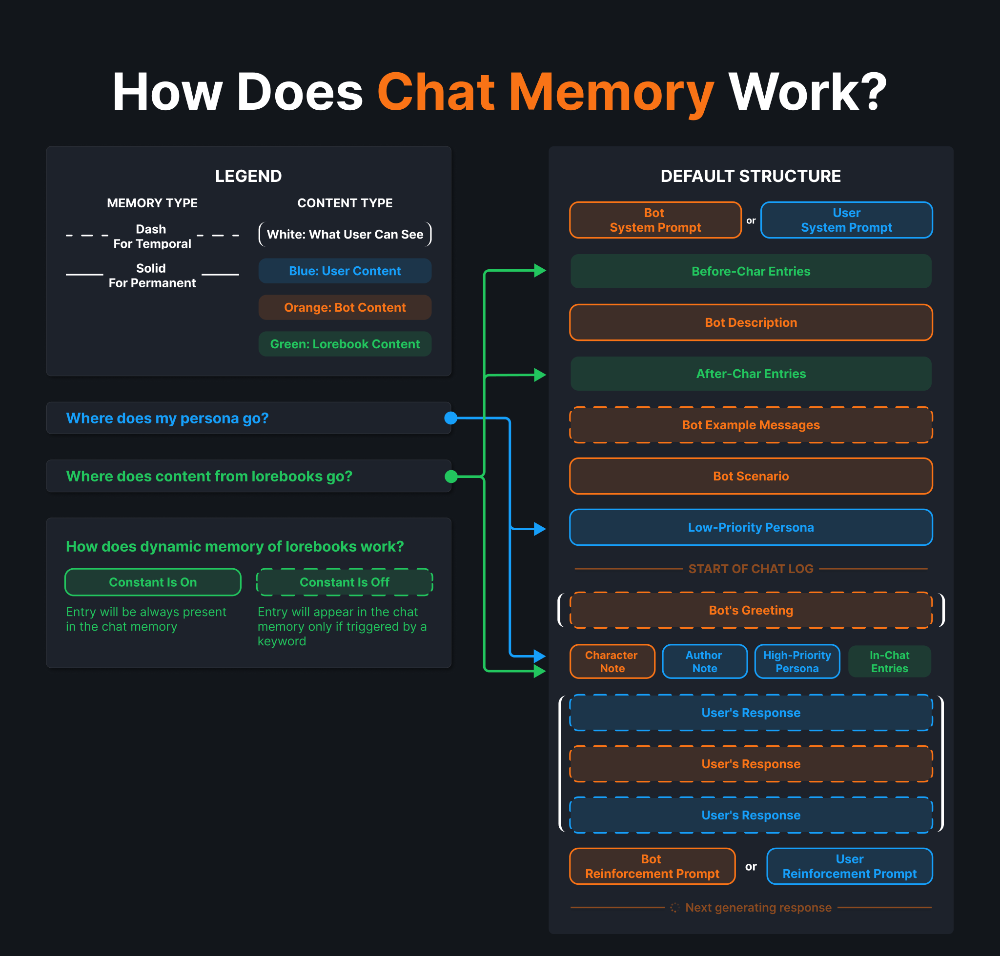

# Lorebook Playground and Interactive guide

 
 

 

# 🧩 Basics

## Lorebooks

Lorebooks (*aka world info*) help your bot to act more in truth, use conditional prompts, and remember more details about characters, setting, or story without using too many tokens of context memory.

Lorebooks contain **entries**. When user or bot mentions a certain **keyword**, the matching entry is temporarily added to the chat memory.

## Entries

An entry is a specific piece of prompt—details or instructions—tied to keywords. Only bots can "read" triggered entries. Users can only check them in the Debug Menu.

## Keys

Keys (or keywords) are words and phrases that, when mentioned in a chat, bring a related entry into bot memory. For example, mentioning "wyvern" pulls in related texts about wyverns, thier habitat and behavior.

Keys have partial match type, meaning a key **"cat"** will defaultly react to words "**cat**erpillar," "**Cat**helyn," and "certifi**cat**ed."

## Other related information you might be missing

**What are tokens?**
    
Tokens are the smallest bits of text AI uses to process and understand language. If people use letters and words, AI uses tokens. 1 token might be a word or a fragment. On average, 1 token is 3.7 symbols, but this varies by model. LLaMA, Mistral, DeepSeek, and GPT each tokenize differently.
    
See it yourself on 🔗 [Huggingface tokenizer playground](https://huggingface.co/spaces/Xenova/the-tokenizer-playground))
    
**How does memory of chat work?**
    
A diagram with the default structure of chat memory, showing where each text from cards, lorebooks, chat itself, or user info goes.
    
When you chat with an AI bot, the chat interface merges your last message with all other texts into one big prompt, using this template. Then the interface sends it to LLM for processing. When AI creates an answer, the interface retrieves it into a message from the bot you're chatting with.
    
The closer a piece of information is to the bottom of this structure, the more impact it has.

# ✍ What can you put in entries? Examples & recommended settings

### Facts & Lore

Story details, world-building, or background info; specific details about characters, places, or objects.

### More speech examples

character's opinion on rare topics or scene examples.

### Instructions

Guidelines for how the bot should respond when the entry is triggered.

### Chat Events Tracking

Replace summary with lorebook. Make notes on key moments of your chat to maintain consistency.

# 📖 Lorebook settings

### Name

Lorebook title. Used in search. Doesn't affect prompt.

### Description

Doesn't affect prompt. Info about the lorebook or brief manual for users goes here.

### Scan Depth

Number of last chat messages the lorebook checks for keywords.

### Token Budget

Number of tokens you reserve for content of entries.

### Recursive scanning

By activating this function, you change the way lorebook searches for keywords.

> When off  
> **Chat Only Scan:** lorebook searches for keywords only in messages withing Scan Depth.

> When on  
> **Looping scan**: lorebook searches for keywords in messages withing Scan Depth, then scans triggered entries and keeps re-scanning appearing entries until triggering stops or token budget is hit.
> 

# 💬 Entries settings

### Name

Entry title. Only for easier navigation. Doesn't affect prompt.

### Enabled

Switcher that turns on and off the entry.

> When Off:  
> The entry is activated.

> When On:  
> The entry is deactivated. Use this when you're still working on it or want users to download your lorebook and choose which entries to use.

### Keys

Comma-separated list of primary keywords that activate the entry.

### Secondary keys

Comma-separated list of extra keywords for entry fine-tuning. Necessary mostly for the use of Selective entries.

### Content

Container for information or instruction that will go into the chat memory to the chosen position.

### Position

- **Before char**: entry goes **before description** of the bot and has a low impact on the next response.
- **After char**: entry goes **under the description** of the bot, near the speech examples and scenario.
- **In-depth**: entry goes **inside the chat** log and has the biggest impact on the next response. Especially if the Chat Depth is 1-3.

### Chat Depth

Tells how far into the chat the entry should go if you use the In-Depth setting. For example, Chat Depth of 3 puts the entry between the 2nd and 4th message from the end.

### Priority

Number of entry "importance level". If many entries are triggered at once and they can't fit in the Token Budget, the lorebook picks entries based on how high their priority is.

### Constant

Decides if the entry always goes into the chat or only when a keyword is used.

> When Off:
> Trigger-only: non-constant entry goes in memory only when keyword is used.

> When On:
> Always there: constant entry stays in the prompt whenever key is mentioned or not.

### Selective

Decides how the bot uses the keywords to trigger the entry.

> When Off:
> The entry will be triggered by any word from primary OR secondary keys.

> When On:
> The entry will be triggered only if at least one of primary AND secondary keys is used.

### Case Sensitive

This setting controls if big and small letters matter in keywords.

> When Off:
> The letter case of keywords won't matter.

> When On:
> The letter case of keywords will matter.
